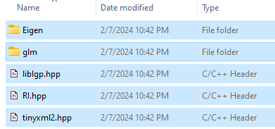
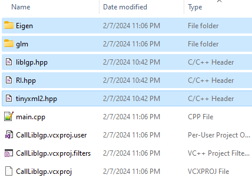
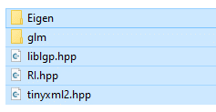
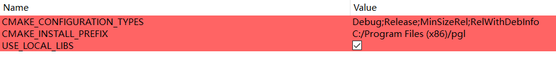

This code is header-only library developed by Haisen Zhao.

# Dependency

Depend on [glm](https://github.com/g-truc/glm.git) and [eigen](https://github.com/libigl/eigen.git) but you don't need to install them explicitly.


# Call liblgp

## Call liblgp in your project
<<<<<<< HEAD

- First, download this  repository "[liblgp](https://github.com/haisenzhao/liblgp)" to your computer.
- Open the "liblgp" folder and copy all files and sub-folders.<br> 
- Open the folder where your own project is located, then paste the files.<br> 
- To call liblgp in your code, you can run the following code to check if it can be called.

=======
- Download liblgp.hpp, RI.hpp, tinyxml2.hpp and local\_libs
- Found Eigen and glm in the "liblgp" folder and copy liblgp.hpp, RI.hpp, tinyxml2.hpp and the Eigen and glm folders under the "liblgp" folder to the project location.  
 <br>
- Then you can call liblgp in your code!
- You can run the following code to check if liblgp can be called
>>>>>>> 8350fc040d009a3a73fad910d4ff39a89155f60b

```cpp
#include "iostream"
#include "liblgp.hpp"
#include "RI.hpp"
#include "tinyxml2.hpp"

using namespace std;
using namespace liblgp;

int main(int argc, char* argv[])
{
	std::cerr << "WinGetCurDirectory: " << Functs::WinGetCurDirectory() << std::endl;
	std::cerr << "WinGetUserName: " << Functs::WinGetUserName() << std::endl;
	system("pause");
	return 0;
}
```


# Usage in Cmake

```
cmake_minimum_required(VERSION 3.5)

set(CMAKE_CXX_STANDARD 11)

# Set the project name
project (liblgp)

#add _CRT_SECURE_NO_WARNINGS
if(MSVC)
    add_definitions(-D_CRT_SECURE_NO_WARNINGS)
endif()

#define option to use local libs
option(USE_LOCAL_LIBS "Use local library" OFF)

# Create a sources variable with a link to all cpp files to compile
set(SOURCES
    liblgp.hpp
    RI.hpp
    tinyxml2.hpp
    main.cpp
)
# Add an executable with the above sources
add_executable(liblgp ${SOURCES})

if(USE_LOCAL_LIBS)
   set(GlmIncludeDir ${PROJECT_SOURCE_DIR}/liblgp)
   set(EigenIncludeDir ${PROJECT_SOURCE_DIR}/liblgp)
else()
   include(ExternalProject)
   ExternalProject_Add(
       glm
       PREFIX ${CMAKE_BINARY_DIR}/third_party/glm
       GIT_REPOSITORY https://github.com/g-truc/glm.git
       CONFIGURE_COMMAND ""
   	   UPDATE_DISCONNECTED 1
       BUILD_COMMAND ""
       INSTALL_COMMAND ""
       LOG_DOWNLOAD ON
       )
   ExternalProject_Get_Property(glm source_dir)
   set(GlmIncludeDir ${source_dir})

   ExternalProject_Add(
       eigen
       PREFIX ${CMAKE_BINARY_DIR}/third_party/eigen
       GIT_REPOSITORY https://github.com/libigl/eigen.git
       CONFIGURE_COMMAND ""
	   UPDATE_DISCONNECTED 1
       BUILD_COMMAND ""
       INSTALL_COMMAND ""
       LOG_DOWNLOAD ON
       )
   ExternalProject_Get_Property(eigen source_dir)
   set(EigenIncludeDir ${source_dir})
endif()

target_include_directories(${PROJECT_NAME} PUBLIC ${PROJECT_BINARY_DIR} PRIVATE ${GlmIncludeDir} ${EigenIncludeDir})

include_directories(${PROJECT_SOURCE_DIR})

if(NOT USE_LOCAL_LIBS)
   add_dependencies(${PROJECT_NAME} glm)
   add_dependencies(${PROJECT_NAME} eigen)
endif()

#set_target_properties(liblgp PROPERTIES LINKER_LANGUAGE C)
```
## Cmake option
- When you use Cmake, you can choose third-party library or self-content library.<br>
 

# License
All rights about the program are reserved by the authors of this project. The programs can only be used for research purposes. In no event shall the author be liable to any party for direct, indirect, special, incidental, or consequential damage arising out of the use of this program.
