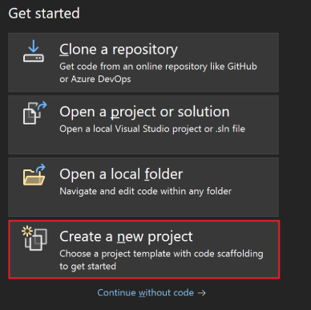
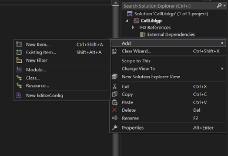
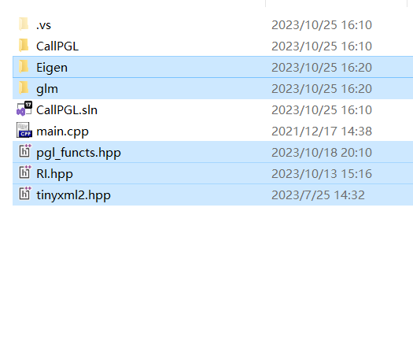

This code is header-only Library developed by Haisen Zhao for his research projects.

# Dependency

Depend on [glm](https://github.com/g-truc/glm.git) and [eigen](https://github.com/libigl/eigen.git) but you don't need to install them explicitly.


# Call PGL

## Create Project
- Open your Visual Studio and create a new project.
- Right-click on your project in the "Solution Explorer" and select "Add" "New item..."

## Call PGL in your project
- Download pgl\_functs.hpp,RI.hpp,tinyxml2.hpp and local\_libs
- Found Eigen and glm in the local_libs folder and copy pgl\_functs.hpp,RI.hpp,tinyxml2.hpp and the Eigen and glm folders under the local folder to the project location
- Then you can call PGL in your code!
- You can run the following code to check if PGL can be called

```cpp

#include "iostream"
#include "pgl_functs.hpp"
#include "RI.hpp"
#include "tinyxml2.hpp"

using namespace std;
using namespace PGL;

int main(int argc, char* argv[])

{

	std::cerr << "WinGetCurDirectory: " << Functs::WinGetCurDirectory() << std::endl;
	std::cerr << "WinGetUserName: " << Functs::WinGetUserName() << std::endl;
	
	system("pause");
	return 0;
}
 
```


# Usage in Cmake

```

include(ExternalProject)
ExternalProject_Add(
    pgl
    PREFIX ${CMAKE_BINARY_DIR}/third_party/pgl
    GIT_REPOSITORY https://github.com/haisenzhao/personal-geom-lib.git
    CONFIGURE_COMMAND ""
	UPDATE_DISCONNECTED 1
    BUILD_COMMAND ""
    INSTALL_COMMAND ""
    LOG_DOWNLOAD ON
    )
ExternalProject_Get_Property(pgl source_dir)
set(PglIncludeDir ${source_dir})

ExternalProject_Add(
    glm
    PREFIX ${CMAKE_BINARY_DIR}/third_party/glm
    GIT_REPOSITORY https://github.com/g-truc/glm.git
    CONFIGURE_COMMAND ""
	UPDATE_DISCONNECTED 1
    BUILD_COMMAND ""
    INSTALL_COMMAND ""
    LOG_DOWNLOAD ON
    )
ExternalProject_Get_Property(glm source_dir)
set(GlmIncludeDir ${source_dir})

ExternalProject_Add(
    eigen
    PREFIX ${CMAKE_BINARY_DIR}/third_party/eigen
    GIT_REPOSITORY https://github.com/libigl/eigen.git
    CONFIGURE_COMMAND ""
	UPDATE_DISCONNECTED 1
    BUILD_COMMAND ""
    INSTALL_COMMAND ""
    LOG_DOWNLOAD ON
    )
ExternalProject_Get_Property(eigen source_dir)
set(EigenIncludeDir ${source_dir})

include_directories(${GlmIncludeDir} ${PglIncludeDir} ${EigenIncludeDir})
add_dependencies(${PROJECT_NAME} pgl)
add_dependencies(${PROJECT_NAME} glm)
add_dependencies(${PROJECT_NAME} eigen)
```
## Cmake option
- When you use Cmake, you can choose third-party library or self-content library.

# License
All rights about the program are reserved by the authors of this project. The programs can only be used for research purposes. In no event shall the author be liable to any party for direct, indirect, special, incidental, or consequential damage arising out of the use of this program.
